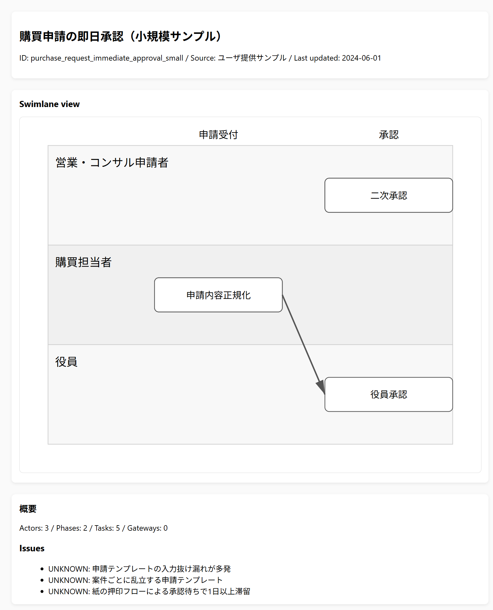

# output ディレクトリ

Windowsローカル閲覧を想定し、flow.html / flow.svg / review_checklist.txt はUTF-8(BOM付)で再生成すること。
常に最新の成果物を配置する。フェーズごとにサブフォルダを切る場合は `phase-<n>/flow.*` の形で管理する。

| ファイル | 用途 |
| --- | --- |
| `flow.json` | レイヤー1の確定版独自JSON。 |
| `flow.html` | Python製レイアウト入りの静的プレビュー。`flow.svg` を埋め込んで確認できる。 |
| `flow.svg` | `src/export/visualizer.py` が生成する泳線図。bpmn-js 出力で置き換えてもよい。 |
| `flow.png` | bpmn-js から書き出したPNG。 |
| `flow.bpmn` | レイヤー2の BPMN 2.0 XML。 |
| `review_checklist.txt` | PLAN §8 の観点を自動判定したログ。人手レビューの補助用。 |

lint ログやレビュー記録を追加する場合は `logs/` サブディレクトリを作成する。

## プレビューとレビュー観点

- Swimlane（役割レーン）とフェーズ見出しが重ならず、余白が均一かを確認すること
- ゲートウェイ／矢印がタスクを横切っていないか、条件ラベルが読める位置かをチェックすること
- Issues セクションは UNKNOWN を含む暫定メモなので、レビュー時に人手で補完すること

