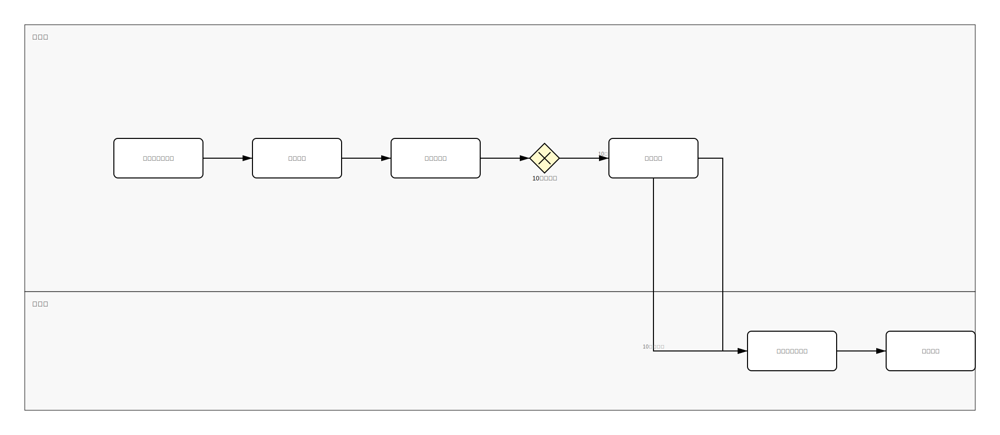

# BPMN Sample Outputs

This directory contains representative BPMN 2.0 XML files and their corresponding SVG visualizations, generated from the JSON flow samples in `samples/expected/`.

## Files

| Sample | BPMN XML | SVG Visualization | Description |
|--------|----------|-------------------|-------------|
| sample-tiny-01 | [sample-tiny-01.bpmn](./sample-tiny-01.bpmn) | [sample-tiny-01-bpmn.svg](./sample-tiny-01-bpmn.svg) | Simple procurement flow (2 actors, 6 tasks, 1 gateway) |
| sample-small-01 | [sample-small-01.bpmn](./sample-small-01.bpmn) | [sample-small-01-bpmn.svg](./sample-small-01-bpmn.svg) | Small business process (2 actors, 4 tasks) |
| sample-medium-01 | [sample-medium-01.bpmn](./sample-medium-01.bpmn) | [sample-medium-01-bpmn.svg](./sample-medium-01-bpmn.svg) | Employee onboarding flow (4 actors, 4 tasks, 1 gateway) |
| sample-large-01 | [sample-large-01.bpmn](./sample-large-01.bpmn) | [sample-large-01-bpmn.svg](./sample-large-01-bpmn.svg) | Complex multi-department process |

## Viewing the Files

### BPMN XML Files (.bpmn)
The `.bpmn` files are BPMN 2.0 compliant XML files that can be opened and edited in:
- [Camunda Modeler](https://camunda.com/download/modeler/)
- [bpmn.io](https://demo.bpmn.io/)
- Any BPMN 2.0 compliant tool

### SVG Visualizations (.svg)
The `.svg` files can be viewed directly in:
- Web browsers (simply drag and drop the file)
- GitHub (automatically rendered in the browser when viewing the file)
- Any SVG-compatible image viewer
- Embedded in Markdown documents

## Example: sample-tiny-01

This is a simple procurement approval flow with:
- **2 Actors (Swimlanes)**: 営業部 (Sales), 総務部 (General Affairs)
- **6 Tasks**: Need confirmation, quote acquisition, request creation, manager approval, general affairs approval, delivery
- **1 Exclusive Gateway**: Amount decision (¥100,000 threshold)
- **7 Sequence Flows**: Including conditional branches

### Preview



## BPMN 2.0 Features

All generated BPMN files include:
- ✅ **Collaboration structure** with participants and lanes
- ✅ **User Tasks and Service Tasks** (distinguished by actor type)
- ✅ **Gateways** (Exclusive, Parallel, Inclusive)
- ✅ **Sequence Flows** with conditional expressions
- ✅ **Diagram Interchange (DI)** for visual representation
- ✅ **Dynamic layout** calculation (no hardcoded coordinates)

## Generation Command

These files were generated using:

```bash
python -m src.core.bpmn_converter \
  --input samples/expected/<sample-name>.json \
  --output samples/bpmn/<sample-name>.bpmn \
  --validate
```

The converter automatically generates both BPMN XML and SVG visualization unless disabled with `--no-svg`.

## Validation

All BPMN files in this directory have passed BPMN 2.0 validation using the built-in validator:

```bash
python -m src.core.bpmn_validator <file>.bpmn
```

## Further Reading

- [BPMN 2.0 Specification](https://www.omg.org/spec/BPMN/2.0/)
- [BPMN Visual Representation Guide](https://www.bpmn.org/)
- [Project Documentation](../../README.md)
